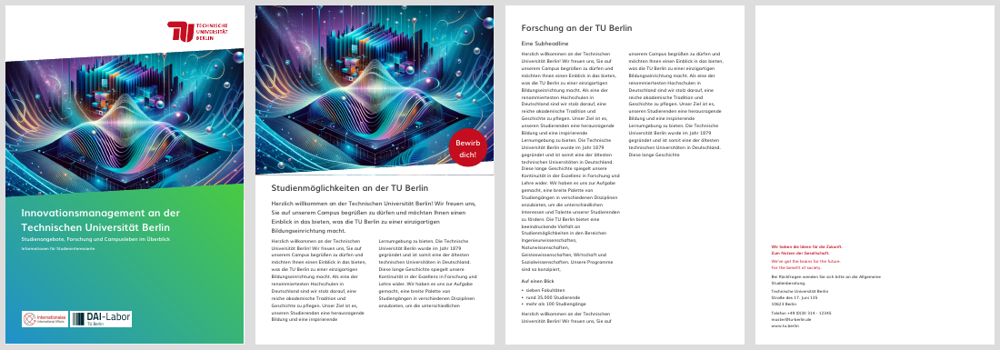
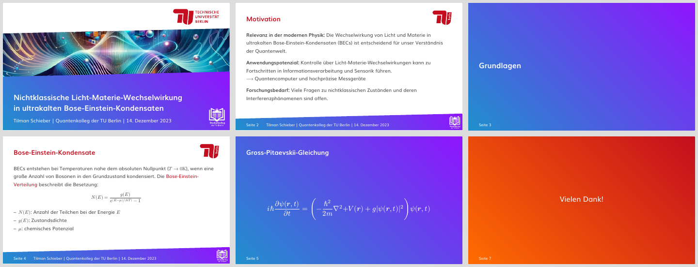

# tubci

Typst templates in the corporate design of TU Berlin: brochures/flyers and
presentation slides, sharing one set of colours, gradients, logos and fonts.




This is an unofficial template, not affiliated with or endorsed by TU Berlin.
The photos in the examples are AI-generated placeholders.

## Setup

The design uses the font **Muli**, shipped in `fonts/`. Pass it to the
compiler (the typst.app web editor picks up the folder by itself):

```sh
typst compile --root . --font-path fonts examples/brochure.typ
typst compile --root . --font-path fonts examples/slides.typ
```

`make` rebuilds both example PDFs using only the bundled fonts.

To use the package from any project, clone it into the local package
directory and import it as `@local/tubci:0.1.0`:

```sh
git clone https://github.com/tilman-schieber/tubci \
  ~/.local/share/typst/packages/local/tubci/0.1.0
```

## Brochure

```typ
#import "@local/tubci:0.1.0": *

#show: tub-brochure.with(paper: "a5", theme: "blue-green")

#title-page(
  title: [Innovationsmanagement],
  subtitle: [Studienangebote im Überblick],
  picture: image("campus.jpg"),
)

#picture-page(image("students.jpg"), badge: [Neu!])[
  = Überschrift
  == Vorspann
  Text …
]

#back-page[Technische Universität Berlin \ Straße des 17. Juni 135]
```

| Function | Purpose |
| --- | --- |
| `tub-brochure(paper, theme, cmyk, lang, font, numbering)` | Document setup. `paper` is `"a4"` or `"a5"`; `cmyk: true` switches to the print palette. |
| `title-page(title, subtitle, info, picture, logos, theme)` | Cover. Without `picture` the themed area fills the page; `theme: white` gives a white cover with a red title. |
| `picture-page(picture, height, badge)[..]` | Inner page opening with a full-bleed picture and an optional round badge ("Störer"). |
| `back-page(claim, bilingual, logo)[..]` | Back cover with the TU claim and contact details. |
| `tub-claim(bilingual)` | The claim on its own. |

## Slides

Built on [polylux](https://polylux.dev/book/); its overlay helpers (`later`,
`uncover`, `only`, `item-by-item`, `side-by-side`, …) are re-exported.

```typ
#import "@local/tubci:0.1.0": *

#show: tub-slides.with(
  theme: "blue-violet",
  footer: [Name | Institut | Datum],
  sublogo: image("institute-logo-white.svg"),
)

#title-slide(title: [Titel], subtitle: [Name], picture: image("title.jpg"))
#section-slide[Grundlagen]
#slide(title: [Motivation])[Inhalt mit #alert[Hervorhebung]]
#focus-slide(title: [Kernaussage])[$E = m c^2$]
```

| Function | Purpose |
| --- | --- |
| `tub-slides(aspect-ratio, theme, footer, sublogo, lang, font)` | Presentation setup. `aspect-ratio` is `"16-9"` or `"4-3"`; `lang` also sets "Seite"/"Page". |
| `title-slide(title, subtitle, picture, theme)` | Opening slide, with or without picture. |
| `slide(title)[..]` | Content slide. |
| `focus-slide(title, theme)[..]` | Full-colour slide for one statement or formula. |
| `section-slide[..]` | Section divider. |
| `alert[..]` | Text in TU red. |

## Colours and themes

`theme` takes a gradient name (`"orange-red"`, `"red-violet"`, `"blue-green"`,
`"blue-violet"`), a colour name (`"red"`, `"orange"`, `"violet"`, `"blue"`,
`"green"`, `"dark-gray"`, `"light-gray"`, `"black"`), or any Typst colour or
gradient. Every page and slide function accepts its own `theme` to deviate
from the document's.

The palettes are available as `tub-rgb` and `tub-cmyk` (`tub-colors` and
`tub-gradients` are shortcuts into the RGB one), the logo as
`tub-logo(kind: "long" | "short", width: ..)`.

## License

The code is released under the [MIT License](LICENSE). Not covered by it:

- the Muli fonts in `fonts/`, licensed under the
  [SIL Open Font License](fonts/OFL.txt);
- the TU Berlin logos in `assets/` and the logos in `examples/img`, which
  remain the property of their owners and are subject to the university's
  corporate design rules.
